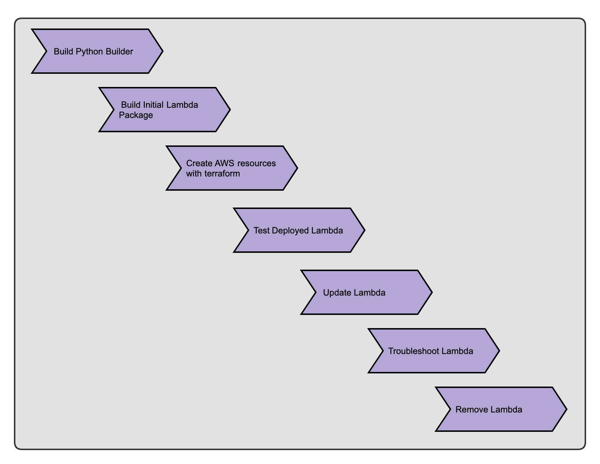

# Super Important Lambda Demo

_Description: Demo of things Joe learned while messing around with Lambdas_


## Background

### Addressing need for Lambdas
* We needed a way to provision certificates in the new AWS account
    - We didn't have [Rundeck](https://www.rundeck.com/open-source) to help us out
    - There would be more overhead and cost to exploring ECS or EKS
    - Lambdas are usually cheap to run
* We already have lambdas in production, but no one is currently supporting/owning them from a standardization and deployment perspective

## Demo Overview




## Demo Build Directions

### Pre-Flight

#### Software
* Install [awscli](https://docs.aws.amazon.com/cli/latest/userguide/cli-chap-install.html) and configure an account named `lambda-demo` with the default region `us-east-1`: 
    - `aws configure --profile lambda-demo`
* Install [Docker](https://docs.docker.com/install/)
* Install [Terraform](https://releases.hashicorp.com/terraform/0.11.12/)

#### Github
* Make sure you have access to the [docker-python-lambda-builder](https://github.com/jperez3/docker-python-lambda-builder) repo before starting

#### Music

* Start 80s Synthwave Music: `make start-music`

### Building a Lambda Package

* Docker was necessary because the AWS documentation wants you to provision an Amazon Linux EC2 instance
    - Instead I created [docker-python-lambda-builder](https://github.com/jperez3/docker-python-lambda-builder) which will take an app and its dependencies and zip them
* Download/Build the lambda builder container: `make docker-init`
* After the build has finished, package the lambda: `make lambda-build`
    - This will zip the application and dependencies

### Create Lambda with Terraform

* Terraform will create the structure needed to support the lambda in AWS
* Initialize Terraform: `make tf-init`
* Use Terraform to provision new lambda: `make tf-apply`
    - You will be prompted to review and confirm the changes


### Testing the Lambda

* After terraform has completed, you can `invoke` the function and its handler: `make lambda-invoke`
    - Think of the handler as a substitute of `main` in python


### Updating the Lambda

* You decide you want to make changes to your function, simply go to the `lambda` folder and edit `app.py`
* After making changes, rebuild the lambda packages, upload the lambda, and invoke the function: `make lambda-build lambda-upload lambda-invoke` or `make lambda-refresh`


### Troubleshooting the Lambda

* Log into the [AWS console](https://console.aws.amazon.com/iam/home?region=us-east-1) for the account you specified in `awscli`
* Navigate to the Lambda control panel
* Click on the function that you just created `demo_testservice_stg_useast1_example_com`
* Here you can review the function code
    - Note: If the function is deemed too big by AWS, you will not be able to use this IDE.
* You can also change the `handler` to the `test_handler` specified in `app.py`
* Press the `Save` button on the top right corner, click the empty drop-down menu to the left of the `Test` button and select `Configure test event`
* Give the `Event name` a name and then press `Create`
* You can now press the `Test` button
* Review the `Execution results` in the console to see what happened with the `test_handler`
* You can also see more robust logs by pressing the `Logs` link next to the `Execution results`


### Removing Lambda

* Destroy lambda resources: `make tf-destroy`
* Confirm deletion by submitting `yes`
_Sample Destroy Output_
```
$ make tf-destroy
terraform destroy terraform/
data.template_file.lambda_assume_role: Refreshing state...
aws_iam_role.lambda_role: Refreshing state... (ID: demo_testservice_stg_useast1_example_com)
aws_lambda_function.lambda_demo: Refreshing state... (ID: demo_testservice_stg_useast1_example_com)

An execution plan has been generated and is shown below.
Resource actions are indicated with the following symbols:
  - destroy

Terraform will perform the following actions:

  - aws_iam_role.lambda_role

  - aws_lambda_function.lambda_demo


Plan: 0 to add, 0 to change, 2 to destroy.

Do you really want to destroy all resources?
  Terraform will destroy all your managed infrastructure, as shown above.
  There is no undo. Only 'yes' will be accepted to confirm.

  Enter a value: yes

aws_lambda_function.lambda_demo: Destroying... (ID: demo_testservice_stg_useast1_example_com)
aws_lambda_function.lambda_demo: Destruction complete after 5s
aws_iam_role.lambda_role: Destroying... (ID: demo_testservice_stg_useast1_example_com)
aws_iam_role.lambda_role: Still destroying... (ID: demo_testservice_stg_useast1_example_com, 10s elapsed)
aws_iam_role.lambda_role: Destruction complete after 11s
```

* Remove docker images: `make docker-cleanup`


## Lessons Learned
* Lambdas aren't always fun to debug
* Keep Lambdas small, don't implement more than a few functions
* Lambdas/Serverless won't fix all problems. It actually introduces new problems too


## Additional Thoughts
* There are a bunch more things that lambdas can do
    - Interface with other AWS resources
    - We didn't even touch on the API Gateway (Ask Carlo for more details)
* Deployment pipelines need to be figured out for each runtime (python/ruby/nodejs)
* Terraform is great for provisioning the resources, but not great for updating the lambda after initialization
* Lambdas are great for monitoring checks